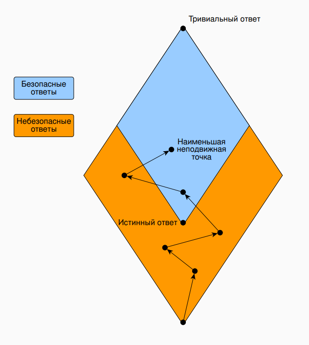
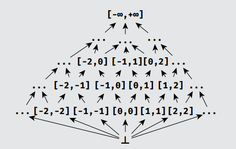
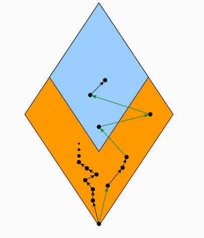
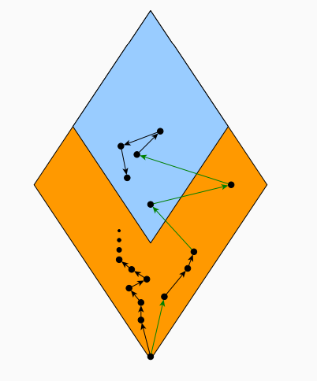

# 1. Понятия анализа и верификации ПО. Классификация методов анализа ПО. Непротиворечивость, полнота и точность анализа. Проблемы анализа ПО: теорема Тьюринга, теорема Райса.

# 2. Основные подходы к статическому анализу ПО. Сигнатурный поиск. Понятие абстрактного синтаксического дерева, другие модели ПО.

# 3. Анализ ПО на основе типов. Связь классических систем типов и анализа ПО. Системы типов как простейший вид анализа ПО. Полнота и точность анализа на основе систем типов. Понятие анализа на основе ограничений, типичная структура такого анализа.

# 4. Способы решения задачи присвоения типов. Задача унификации. Алгоритмы решения задачи унификации. Рекурсивные типы и регулярная унификация.

# 5. Понятие графа потока управления и моделей на его основе. Понятие чувствительности к потоку управления в анализе ПО. Виды потокочувствительных анализов. Абстрактный домен и абстрактное состояние. Потокочувствительный анализ знаков.

# 6. Введение в теорию решёток. Понятие частично упорядоченного множества. Верхние и нижние грани. Примеры решёток, применимых в анализе ПО. Анализ знака на основе теории решёток.

# 7. Теорема о наименьшей неподвижной точке. Понятие монотонного фреймворка. Алгоритмы поиска неподвижной точки. May- и must- анализ.

### Наименьшая неподвижная точка:

Обычно в результате анализа мы получаем набор переменных $x_1, x_2, \dots, x_n$ и ограничений:

$x_1 = f_1(x_1, x_2, \dots, x_n)$  
$x_2 = f_2(x_1, x_2, \dots, x_n)$ 
$\dots$ 
$x_n = f_n(x_1, x_2, \dots, x_n)$ 

Эти ограничения можно собрать в одну функцию, тогда они примут вид:

$X = f(f_1(x_1, x_2, \dots, x_n),$ 
$\dots, f_n(x_1, x_2, \dots, x_n))$ 

В итоге наша задача при решении - найти наименьший (наиболее точный) $X$, который всё ещё будет удовлетворять поставленным условиям - это значение и называется наименьшей неподвижной точкой.

Сама теорема о неподвижной точке звучит так: Для любой монотонной функции $f : L → L$, определенной на решетке $L$ конечной длины, существует наименьшая неподвижная точка.

### Монотонный фреймворк

В теореме о неподвижной точке есть понятие "монотонная функция". Функция $f : L → L$ является монотонной на решетке $L$, если
$∀x, y ∈ L : x <= y ⇒ (f(x) <= f(y))$ - если совсем упрощать: "при уточнении входных данных результат не должен становиться менее точным".

Функция нескольких аргументов является монотонной, если она монотонна по каждому аргументу. Проверить функцию 
(в контексте анализа знаков функция - каждый используемый оператор) можно путём перебора всех таблиц:

$∀x, y, x' ∈ L : x <= x' ⇒ (x op y <= x' op y) $ 
$∀x, y, y' ∈ L : y <= y' ⇒ (x op y <= x op y')$ 

Иными словами: "при более точных аргументах результат функции не должен быть менее точным".

Сам монотонный фреймворк представляет из себя:
- Набор вершин CFG программы;
- Решётку конечной длины L (представление интересующего нас домена);
- Набор переменных для каждой вершины CFG;
- Набор ограничений для различных видов узлов CFG.

Используя всё вышеперечисленное, можно извлечь ограничения из CFG и решить их, используя алгоритм поиска неподвижной точки.

### Поиск неподвижной точки

##### Простейший алгоритм

Для начального $X = (⊥, \dots, ⊥)$ расчитываем $X = f(X)$, пока $X$ не перестанет изменяться. Алгоритм корректный, 
но долгий - никак не учитывает ни структуру CFG/используемой решётки.

##### Round-robin / хаотический

Для начального $(x_1,\dots, x_n) = (⊥, \dots, ⊥)$ расчитываем $x_i = f_i(x_1,\dots, x_n)$, пока $(x_1,\dots, x_n)$ не перестанет изменяться.
В round-robin $i$ изменяется в пределах $1..n$ (перебираем $x_i$ по очереди), в хаотическом - принимает случайное значение в тех же пределах.

##### Структурный алгоритм

Используем структуру CFG: будем итеративно проходиться по всем вершинам графа, для каждой вершины в списке $WL$:
- Расчитывая $y = f_i(x_1,\dots, x_n)$;
- Если $x_i != y$, то $x_i = y$ и добавляем потомков текущей вершины в $WL$.

Можно и дальше улучшить алгоритм, особым образом приоретизируя вершины или анализируя иные зависимости вершин друг от друга.

На условной решётке ход работы алгоритма выглядит примерно следующим образом:

### May- и Must- анализы

В моментах, когда нам необходим ответ, который точно будет включать в себя истинный, используется May-анализ, он же переаппроксимация:
- Решётка обходится снизу вверх, от частных результатов к общим;
- Например, анализ знаков, поиск живых переменных (live variables), обнаружение зависимостей значения текущей переменной (reaching definitions).

И, напротив, Must-анализ, он же недоаппроксимация, используется в обратных случаях:
- На практике рассматривают решётку не с $<=$, а с $>=$;
- Используется при поиске предрасчитанных выражений (availible expressions) и анализе занятости (very busy expressions).

# 8. Анализ живости. Анализ готовых выражений.

### Анализ живости

Анализ живости (live variables) служит для поиска живых переменных в различных точках программы, а "мёртвые" переменные 
можно просто игнорировать во многих задачах анализа/оптимизации, что уменьшает фактическую размерность задач.

Так как живость переменной в какой-либо момент выполнения программы - нетривиальное свойство, его необходимо аппроксимировать: 
будем искать в первую очередь те переменные, которые ТОЧНО мертвы (May-анализ). 

В качестве решётки будем использовать булеан от всех переменных программы - таким образом, самым безопасным для нас 
ответом будет живость всех переменных в рассматриваемой точке программы.

В качестве точек программы будем рассматривать состояния программы ДО вершин CFG с использованием следующих правил:

$var x; = JOIN(n) \ {x} $ 
$x = E; = JOIN(n) \ {x} ∪ vars(E) $ 
$n = JOIN(n) ∪ vars(n)$ 

Иными словами:
- При инициализации переменной удаляем её из списка живых;
- При назначении переменной какого-либо значения удаляем её из списка живых, затем добавляем в список все использованные в расчёте переменные;
- При любых других выражениях добавляем в список живых все используемые переменные.

$JOIN(n)$ в данном анализе - объединение полученных от всех потомков значений -> сам анализ выполняется в обратном порядке (Backward analysis)

### Анализ готовых выражений

Анализ готовых выражений (Available expressions) служит для поиска рассчитанных ранее выражений (уже рассчитанные выражения можно не пересчитывать повторно).
Так как "готовность" выражения в какой-либо момент выполнения программы - нетривиальное свойство, его необходимо аппроксимировать:
будем искать в первую очередь те переменные, которые уже точно считались (Must-анализ).

В качестве решётки будем использовать перевёртнутый булеан от всех переменных программы - таким образом, самым безопасным для нас
ответом будет отсутствие расчитанных переменных в рассматриваемой точке программы.

В качестве точек программы будем рассматривать состояния программы после вершин CFG с использованием следующих правил:

$x = E; = removerefs(JOIN(n) ∪ exprs(n), x) $ 
$n = JOIN(n) ∪ exprs(n)$ 

Иными словами:
- При назначении переменной какого-либо значения удаляем все выражения, в которых эта переменная использовалась;
- При наличии любых других нетривиальных выражений добавляем их в список.

$JOIN(n)$ в данном анализе - пересечение полученных от всех предшественников значений -> сам анализ выполняется в прямом порядке (Forward analysis)

# 9. Анализ занятости. Анализ достижимых значений. Распространение констант.

### Анализ занятости

Анализ занятости (Very busy expressions) служит для поиска выражений, которые были гарантированно использованы до интересующей нас точки в программе.
Так как "готовность" выражения в какой-либо момент выполнения программы - нетривиальное свойство, его необходимо аппроксимировать:
будем искать в первую очередь те переменные, которые уже точно использовались (Must-анализ).

В качестве решётки будем использовать перевёртнутый булеан от всех переменных программы - таким образом, самым безопасным для нас
ответом будет отсутствие использованных до рассматриваемой точки программы выражений.

В качестве точек программы будем рассматривать состояния программы ДО вершин CFG с использованием следующих правил:

$x = E; = removerefs(JOIN(n), x) ∪ exprs(n) $ 
$n = JOIN(n) ∪ exprs(n) $ 

Иными словами:
- При назначении переменной какого-либо значения удаляем все выражения, в которых эта переменная использовалась, затем добавляем все используемые при расчёте присваиваемого значения переменные;
- При наличии любых других нетривиальных выражений добавляем их в список.

$JOIN(n)$ в данном анализе - пересечение полученных от всех потомков значений -> сам анализ выполняется в обратном порядке (Backward analysis)

### Анализ достижимых значений

Анализ достижимых значений (Reaching definitions) служит для поиска тех присваиваний/объявлений, которые отвечают за значения 
переменных в текущей точке программы.
Так как достижимость выражений в какой-либо момент выполнения программы - нетривиальное свойство, его необходимо аппроксимировать:
будем искать наиболее полный набор определений, пусть среди них и будут лишние(Must-анализ).

В качестве решётки будем использовать булеан от всех присваиваний в программе - таким образом, самым безопасным для нас
ответом будут все присваивания.

В качестве точек программы будем рассматривать состояния программы после вершин CFG с использованием следующих правил:

$var x; = {var x} $ 
$x = E; = = removedefs(JOIN(n), x) ∪ {x = E} $ 
$n = JOIN(n)$ 

Иными словами:
- При объявлении переменной включаем её в список;
- При присвоении значения переменной удаляем из списка предыдущее объявление/присвоение ей значения и вносим новое;
- Для всех остальных значений оставляем список без изменений.

$JOIN(n)$ в данном анализе - объединение полученных от всех предшествнников значений -> сам анализ выполняется в прямом порядке (Forward analysis)

### Распространение констант

Распространение констант (Constant propagation) служит для предрасчёта тех значений, которые точно являются константами. 

В простейшем виде используется плоская решётка с перечислением всех возможных констант, однако, такая реализация может быть расширена решёткой для знаков.

При дальнейшем расширении (например, для возможности предрасчёта выражений `x >= 1` (x в домене 1+) ) уже нужна интервальная 
решётка - решётка, ячейки которой являются интервалами значений. При этом данная решётка бесконечна как в высоту, так и в ширину.

# 10. Интервальный анализ. Тривиальная интервальная решётка. Проблемы реализации анализов на основе бесконечных решёток. Widening в применении к решёткам и ограничения, связанные с его применением.

### Интервальный анализ

Интервальный анализ - анализ над интервалами значений. Используется в многих полезных вещах:
- Распространение констант;
- Поиск выходов за границы массива;
- Упрощение выражений;
- т.д.

### Тривиальная интервальная решётка

Простейшая интервальная решётка - булеан от всех возможных интервалов в $\[-\inf, +\inf\]$:

${\[l, u\] |l, u ∈ N ∧ l ⩽ u} ∪ {⊥} $ 
$\[l, u\] <= \[l', u'\] ⇔ l' ⩽ l ∧ u ⩽ u'$ 

### Проблемы реализации анализов на основе бесконечных решёток

Основная проблема тривиальной решётки - то, что она бесконечная. Помимо того, что это несёт за собой проблемы с временем работы, 
все алгоритмы по поиску неподвижной точки не работают (у решётки бесконечная высота). Решение "в лоб", с ограничением размера целых чисел, 
на практике работает плохо, поэтому необходимо иным образом формировать решётку, "загрубляя" её.

### Widening

Widening - способ представления бесконечной интервальной решётки в конечном виде путём загрубления:

$ω(L) = {y ∈ L|∃x ∈ L : y = ω(x)} $ 
$fix(ω ◦ f) -> fix(f)$ 

Иными словами:
- $ω$ - некая "загрубляющая" функция, возвращающая конечную решётку, такую, что её стационарная точка - переаппроксимация стационарной точки исходной матрицы;
- $ω(L)$ - конечная, "загрублённая" решётка от бесконечной решётки $L$.

Один из примеров реализации - загрубление интервалов до ближайших интервалов над $B$ - множеством констант в программе.
Также $B$ дополняется $-\inf, +\inf$.

Однако, результаты после использования widening могут получиться слишком неточными из-за переаппроксимации - их можно и нужно уточнить, и для этого используется narrowing.

# 11. Narrowing в применении к решёткам и ограничения, связанные с его применением. Методы объединения widening и narrowing. Модификации алгоритма решения задачи поиска неподвижной точки с применением widening и narrowing.

### Narrowing

Narrowing - Способ уточнения результатов анализа путём применения функции $f$:

$fix <= fixω $ 
$fix <= f(fixω) <= fixω$ 

Иными словами:
- "Спускаемся" по решётке вниз, не выходя за истинную стационарную точку;
- Можем всё же попасть прямо в стационарную точку, можем остаться там же, можнм очутиться где-то посередине.

Однако, у narrowing тоже имеется ряд проблем:
- Результат, скорее всего, всё ещё будет переаппроксимацией, хоть и более точной, чем сразу после widening;
- Если исходное B подобрано плохо, то narrowing будет работать очень долго.

### Методы объединения widening и narrowing

Классический вариант - сначала использовать только widening, затем - только narrowing.

Однако, можно пробовать применять информацию о структуре программы, и, в соответствии с ней, чередовать widening и 
narrowing - результат, скорее всего, будет точнее и быстрее.

### Модификации алгоритма решения задачи поиска неподвижной точки с применением widening и narrowing

##### Общий widening

Можно ввести общий widening-оператор:

$∇: LxL → L $ 
$l_1 <= (l_1 ∇ l_2) >= l_2 ∀l_1, l_2 ∈ L$ 

Используя тот факт, что для любой возрастающей последовательности $y_(i+1) = y_i ∇ x_(x+1)$ сходится, можем искать стационарную точку 
через $y_(i+1) = y_i ∇ f(y_i)$

##### Общий narrowing

Можно ввести общий narrowing-оператор:

$Δ: LxL → L $ 
$l_1 <= (l_1 Δ l_2) <= l_2 ∀l_1, l_2 ∈ L$ 

Используя тот факт, что для любой нисходящей последовательности $y_(i+1) = y_i Δ x_(x+1)$ сходится, можем искать стационарную точку
через $y_(i+1) = y_i Δ f(y_i)$

##### Warrowing

Объединим общий widening и общий narrowing - для $l_1 ♢ l_2$:
- Если $l_2 <= l1$, то используем narrowing ($l_1 Δ l_2$);
- Иначе используем widening ($l_1 ∇ l_2$).

Подобное совместное использование ускоряет сходимость, увеличивает точность решения, но не работает с стандартными решателями монотонных фреймворков.

# 12. Понятие чувствительности к пути исполнения. Зависимости по данным и по управлению. Предикаты путей. Интервальный анализ, чувствительный к путям исполнения, проблемы, связанные с ним. Выбор множества предикатов путей в общем случае. Метод уточнения абстракции на основе контрпримеров (CEGAR).

# 13. Понятие межпроцедурности в анализе ПО. Пессимистичный межпроцедурный анализ и проблемы, связанные с ним. Полная подстановка тела функции и проблемы, связанные с ней. Понятие полного графа потока управления для программы и анализ на его основе.

# 14. Понятие контекстной чувствительности. Метод ограниченного клонирования процедур, его ограничения и параметризация. Методы улучшения контекстной чувствительности.

# 15. Метод контекстной чувствительности на основе входных данных, его анализ в сравнении с методом ограниченного клонирования процедур. Понятие аппроксимации функции в программе. Проблема внешних функций и варианты её решения.

# 16. Анализ указателей. Анализ псевдонимов. Анализ цели. Анализ формы. Направленный и ненаправленный анализ указателей.

# 17. Алгоритм Стенсгаарда, его реализация на основе унификации.

# 18. Алгоритм Андерсена, его реализация на основе кубического фреймворка. Контекстно-чувствительный анализ указателей.

# 19. Чувствительный к потоку управления анализ указателей. Анализ указателей на основе типов.

# 20. Выпуклые реляционные численные домены. Домен выпуклых многогранников.

# 21. Выпуклые реляционные численные домены. Разностные матрицы и октагоны.

# 22. Реляционные численные домены. Невыпуклые домены: общее представление.
