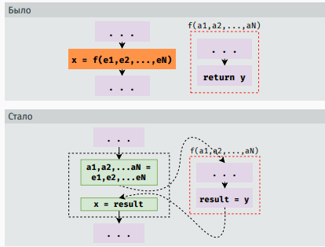

# 1. Понятия анализа и верификации ПО. Классификация методов анализа ПО. Непротиворечивость, полнота и точность анализа. Проблемы анализа ПО: теорема Тьюринга, теорема Райса.

## Понятия анализа и верификации ПО

Анализ ПО — совокупность методов, позволяющих судить о ПО в отрыве от программиста, то есть устанавливать различные
свойства ПО как объекта:

- Является ли программа корректной?
- Соответствует ли она спецификации?
- Можно ли ее оптимизировать?
- Насколько быстро она работает?
- Завершается ли она когда-нибудь?
- Есть ли в ней мертвый код?
- ...

Верификация (по версии Википедии) - формальное доказательство соответствия или несоответствия формального предмета
верификации его формальному описанию.

Верификация - это статический метод анализа ПО, применяющийся с целью точного определения каких-либо свойств.

## Классификация методов анализа ПО

Методы анализа ПО делятся на:

- Статические (не требуют запуска кода для анализа, статический анализ и верификация - именно статические методы);
- Динамические (работают на основе результатов запуска кода);
- Гибридные (совмещают оба подхода - например, автоматическая генерация тестов и последующее их выполнение).

## Непротиворечивость, полнота и точность анализа

Непротиворечивость - (???) свойство формальной системы, заключающееся в невыводимости из неё противоречия.
Противоречивая система имеет ряд правил, которые напрямую или косвенно (через ряд дополнительных логических действий)
начинают противоречить друг другу. Противоречивость свидетельствует о том, что анализируемая система несовершенна.

Метод верификации характеризуется двумя свойствами:

- soundness: если вы доказали какое-то свойство, значит оно действительно было;
- completeness: если свойство имеет место, ваш метод может его доказать.

Статический анализ тоже обладает двумя свойствами:

- precision (точность): доля истинных результатов среди всех полученных;
- recall (полнота): доля обнаруженных результатов среди всех истинных.

Можно неформально сказать, что

- soundness = 100% precision;
- completeness = 100% recall;
- верификация — частный случай статического анализа.

## Проблемы анализа ПО

- Алан Тьюринг(1936 г): **Невозможно** написать алгоритм, который говорит, завершается Тьюринг-полная программа или нет;
- Генри Райс (1952 г): **Невозможно** написать алгоритм, который определяет **любое** нетривиальное свойство
  Тьюринг-полной программы.

Нетривальное свойство - это такое свойство, которое есть у одних программ и его нет у других. Получается, что какие-либо
интересные свойства программы мы получить/узнать не можем.

Есть несколько вариантов решения проблемы:

- Заняться Тьюринг-неполной моделью (Model checking);
- Дополнить недостающую информацию вручную (Дедуктивная и автоматизированная верификации);
- Аппроксимация (сверху/снизу - статический анализ).

# 2. Основные подходы к статическому анализу ПО. Сигнатурный поиск. Понятие абстрактного синтаксического дерева, другие модели ПО.

## Основные подходы к статическому анализу ПО

* Сигнатурный поиск;
* Анализ на основе типов;
* Абстрактная интерпретация;
* Символьное исполнение;
* Анализ потока данных;
* ...

## Сигнатурный поиск

Сигнатурный поиск - отличный метод анализа, но очень простой и неинтересный, хотя и полезный.

Хороший сигнатурный анализатор — это 10000+ сигнатур. Сигнатуры — примеры написания некорректного кода, с которыми
сравнивается анализируемый код, сигнализирующие о том, что и в каких местах может пойти не так.

## Абстрактное синтаксическое дерево (AST)

Самая простая модель — абстрактное синтаксическое дерево (AST). Это конечное помеченное ориентированное дерево, в
котором внутренние вершины сопоставлены (помечены) с операторами языка программирования, а листья — с соответствующими
операндами.

Откуда берется AST?

* В результате парсинга программы получается дерево разбора;
* Далее из него удаляются все лишние элементы, например, комментарии;
* Получаем AST.

Анализ дерева может происходить при помощи различных паттернов:

* ООП: visitors (описываем поведение в зависимости от типа посещённой вершины);
* ФП: pattern matching.

## Другие модели ПО

AST можно дополнять всякими данными про семантику:

* Графы потока данных/управления;
* SSA (static single assignment — каждой переменной значение может быть присвоено всего один раз);
* Графы зависимостей;
* ...

# 3. Анализ ПО на основе типов. Связь классических систем типов и анализа ПО. Системы типов как простейший вид анализа ПО. Полнота и точность анализа на основе систем типов. Понятие анализа на основе ограничений, типичная структура такого анализа.

## Анализ ПО на основе типов, связь классических систем типов и анализа ПО, системы типов как простейший вид анализа ПО

Анализ типов — вид статического анализа у языков, в которых присутствует система статической типизации программы. Анализ
типов позволяет выявить свойства программ, связанных с переменными и операциями над ними относительно их типа.

Анализ типов позволяет гарантировать, что:

* сравнивать можно только выражения одного типа;
* условия в if должны быть булевыми;
* только функции можно вызывать;
* только указатели можно разыменовывать;
* ...

Иными словами, анализ типов позволяет заранее выявить часть ошибок, связанных с некорректным обращением с переменной её
типа.

Говоря про анализ типов, подразумевают одну из следующих задач:

- Type checking (проверка типов)
- Type interference (вывод типов)

Вывод типов обычно вторичен, и если язык поддерживает систему проверки типов, то вывод типов реализовать относительно
просто.

## Полнота и точность анализа на основе систем типов

Как и другие анализаторы нетривиальных свойств, достичь абсолютных показателей полноты и точности невозможно, поэтому
используется аппроксимация с ориентацией на полноту: все программы, которые компилятор считает корректными относительно
системы типов является корректными по факту.

Однако существует множество корректных программ не проходящих проверку типов (slack).

Type soundness — гарантия того, что программа, прошедшая проверку типов на этапе компиляции, не упадет с ошибкой типов
во время ее выполнения.

Однако системы типов во многих языках не всегда могут гарантировать это свойство:

- Массивы в Java;
- void*, union в C;
- Reinterpret cast в C++;
- ...

## Понятие анализа на основе ограничений

Проверка типов является анализом на основе ограничений/уравнений. Из исходного кода составляется модель, из которой
можно составить систему уравнений. Далее данную систему решает решатель.

# 4. Способы решения задачи присвоения типов. Задача унификации. Алгоритмы решения задачи унификации. Рекурсивные типы и регулярная унификация.

## Способы решения задачи присвоения типов

Используя AST анализируемой программы и набор уравнений-правил анализа, можно составить и решить систему уравнений.

Выше приведен предмет правил, по которому каждое выражение программы можно преобразовать в равенство.

На выходе мы хотим получить систему равенств, в котором каждому выражению программы соответствует тип.

## Задача унификации

Для того чтобы автоматизировать процесс решения, используется формализм решателей **унификаторы**:

Есть набор равенств вида: $k(\alpha,b,\beta) = k(f(\beta,\gamma),\gamma,d(\gamma))$

Решение — подбор методом подстановки набора значений таких переменных, при которых верны равенства:

* $\alpha = f(d(b), b)$;
* $\beta = d(b)$;
* $γ = b$.

## Алгоритмы решения задачи унификации

### Линейный алгоритм

Примером алгоритма унифицирующего солвера является линейный алгоритм решения задачи унификации (Патерсон и Вегман,
1978 г.). Алгоритм заключается в многократном выполнении последовательности шагов:

* **delete**: удаляем уравнения вида t = t
* **decompose**: c(a, b, c) = c(x, y, z) => a = x; b = y; c = z
* **conflict**: c(x0, .., xN) = d(y0, .., yN) => ошибка
* **swap**: c(x0, .., xN) = z => z = c(x0, .., xN)
* **eliminate**: x = t если x не содержится в t, но содержится в других уравнениях => подставляем t вместо x во всех
  остальных уравнениях
* **check**: t = f(x0, .., xN) и t содержится в x0,..,xN => ошибка (для рекурсивных типов есть специальная нотация, об
  этом ниже).

Последовательность повторяется до тех пор, пока не сойдутся типы для всех выражений

Сложность *O(N)*; рекурсивные уравнения запрещены.

### Алгоритм регулярная унификация

Регулярная унификация (Хьюет, 1976 г.) позволяет использовать регулярные рекурсивные термы (те, которые можно записать
через $\mu$-нотацию).

Для обозначения рекурсивных типов (типов, значение которых зависит от них же) существует особая μ-нотация:

- `p = alloc; *p = p;`
- `p = &α; p = &p;`
- `p = α where α = &α` -> `p = µα.&α`

Алгоритм основан на системе Union-Find (Галлер и Фишер, 1964 г) – система непересекающихся данных, которая при наличии
набора элементов позволяет разбить их на непересекающиеся подмножества равных друг другу элементов.

Сложность: O(N ∗ A(N)), где A(N) это обратная функция Аккермана

# 5. Понятие графа потока управления и моделей на его основе. Понятие чувствительности к потоку управления в анализе ПО. Виды потокочувствительных анализов. Абстрактный домен и абстрактное состояние. Потокочувствительный анализ знаков.

## Понятие графа потока управления и моделей на его основе

Граф потока управления (CFG) – модель программы, которая представляет все возможные пути ее выполнения; состоит из
базовых блоков и переходов между ними.

## Понятие чувствительности к потоку управления в анализе ПО

Анализ может быть:

* Потоко-нечувствительным:
    * Типы выражений обычно не зависят от потока выполнения или потока данных программы;
    * Уравнения анализа строятся по исходному коду программы (AST).
* Потоко-чувствительным:
    * Результат зависит от порядка выполнения операций;
    * Уравнения анализа строятся по графу потока управления (CFG).

## Абстрактный домен и абстрактное состояние

Абстрактный домен – абстрактная информации, которая описывает конкретные свойства программы в определенный момент
выполнения CFG.

* Абстрактная информация для переменной программы
* Может отличаться в разных точках программы

Для работы с абстрактным доменом используются:

- `eval` - абстрактные вычисления;
- `op` - абстрактный оператор;
- `JOIN(n)` - оператор объединения информации из предшествующих/последующих вершин.

## Потокочувствительный анализ знаков

Потокочувствительный анализ знаков – анализ на основе CFG и решётки знаков, заключающийся в поиске наименьшей
неподвижной точки (конкретнее описано в последующих вопросах).

# 6. Введение в теорию решёток. Понятие частично упорядоченного множества. Верхние и нижние грани. Примеры решёток, применимых в анализе ПО. Анализ знака на основе теории решёток.

## Введение в теорию решёток

Для анализа очень здорово, если домен является решеткой.

Решетка — это частично упорядоченное множество (poset), для любых двух элементов которого есть точная верхняя и точная
нижняя грани.

У решетки есть максимальный (T) и минимальный (⊥) элементы, а также высота (длина максимально возможного пути от ⊥ до
T).

## Понятие частично упорядоченного множества

В полностью упорядоченном множестве связи между значениями характеризуются как меньше/больше.

Частично упорядоченное множество (poset) - это множество S, для которого задано частичное отношение порядка $\subseteq$,
и которое является:

* рефлексивным ($\forall x \in S : x \subseteq x$);
* транзитивным ($\forall x, y, z \in S : x \subseteq y \land y \subseteq z \rightarrow x \subseteq z$);
* анти-симметричным ($\forall x, y \in S : x \subseteq y \land y \subseteq x \rightarrow x = y$);

## Верхние и нижние грани

Верхние и нижние грани:

Иными словами, $Y$ - это верхняя грань $X$, если $Y$ находится в решётке в решётке выше, чем $X$, и по связям можно
добраться от $X$ до $Y$. Точная верхняя грань - это самая нижняя из всех верхних граней.

С нижней/точной нижней гранью аналогично.

## Примеры решёток

* Булеан (решетка над множеством всех подмножеств S)

* Перевёрнутый булеан
* Плоская решетка

* Решётка обображений

## Анализ знака на основе теории решёток

Анализ знака на основе теории решеток:

Иными словами:

- При объявлении переменной её знак неопределён;
- При присваивании переменной какого-либо значения её знак меняется на знак присваиваемого выражения.

Информацию о присвоении знаков нужно объединить (`JOIN`) с информацией о типах из предшествующих вершин.

# 7. Теорема о наименьшей неподвижной точке. Понятие монотонного фреймворка. Алгоритмы поиска неподвижной точки. May- и must- анализ.

## Наименьшая неподвижная точка:

Обычно в результате анализа мы получаем набор переменных $x_1, x_2, \dots, x_n$ и ограничений:

$x_1 = f_1(x_1, x_2, \dots, x_n)$  
$x_2 = f_2(x_1, x_2, \dots, x_n)$  
$\dots$  
$x_n = f_n(x_1, x_2, \dots, x_n)$

Эти ограничения можно собрать в одну функцию, тогда они примут вид:

$$
X = f(f_1(x_1, x_2, \dots , x_n), \dots , f_n(x_1, x_2, \dots , x_n))
$$

В итоге наша задача при решении - найти наименьший (наиболее точный) $X$, который всё ещё будет удовлетворять
поставленным условиям - это значение и называется наименьшей неподвижной точкой.

Сама теорема о неподвижной точке звучит так: Для любой монотонной функции $f : L \rightarrow L$, определенной на решетке
$L$ конечной длины, существует наименьшая неподвижная точка.

Функция $f : L \rightarrow L$ является монотонной на решетке $L$, если
$\forall x, y \in L : x \sqsubseteq y \rightarrow (f(x) \sqsubseteq f(y))$.

Если совсем упрощать: "при уточнении входных данных результат не должен становиться менее точным".

Функция нескольких аргументов является монотонной, если она монотонна по каждому аргументу.

## Монотонный фреймворк

Проверить функцию на монотонность (в контексте анализа знаков функция - каждый используемый оператор) можно путём
перебора всех таблиц:

$\forall x, y, x' \in L : x \sqsubseteq x' \rightarrow (x op y \sqsubseteq x' op y)$  
$\forall x, y, y' \in L : y \sqsubseteq y' \rightarrow (x op y \sqsubseteq x op y')$

Сам монотонный фреймворк представляет собой:

- Набор вершин CFG программы;
- Решётку конечной длины L (представление интересующего нас домена);
- Набор переменных для каждой вершины CFG;
- Набор ограничений для различных видов узлов CFG.

Используя всё вышеперечисленное, можно извлечь ограничения из CFG и решить их, используя алгоритм поиска неподвижной
точки.

## Поиск неподвижной точки

### Простейший алгоритм

Для начального $X = (⊥, \dots, ⊥)$ расчитываем $X = f(X)$, пока $X$ не перестанет изменяться. Алгоритм корректный,
но долгий - никак не учитывает ни структуру CFG/используемой решётки.

### Round-robin / хаотический

Для начального $(x_1,\dots, x_n) = (⊥, \dots, ⊥)$ расчитываем $x_i = f_i(x_1,\dots, x_n)$, пока $(x_1,\dots, x_n)$ не
перестанет изменяться.

В round-robin $i$ изменяется в пределах $1..n$ (перебираем $x_i$ по очереди), в хаотическом – принимает случайное
значение в тех же пределах.

### Структурный алгоритм

Можно использовать структуру CFG, и при расчете каждого его узла учитывать информацию всех предыдущих.

Для этого составляется worklist ($WL$), содержащий очередь узлов для обработки и уравнения, которые к ним привязаны.
Обработка
происходит в соответствии с зависимостями переменных друг от друга:

- Расчитывая $y = f_i(x_1,\dots, x_n)$;
- Если $x_i != y$, то $x_i = y$ и добавляем потомков текущей вершины в $WL$.

Можно и дальше улучшить алгоритм, особым образом приоретизируя вершины или анализируя иные зависимости вершин друг от
друга.

На условной решётке ход работы алгоритма выглядит примерно следующим образом:

## May- и Must- анализы

В моментах, когда нам необходим ответ, который точно будет включать в себя истинный, используется May-анализ, он же
переаппроксимация:

- Решётка обходится снизу вверх, от частных результатов к общим;
- Например, анализ знаков, поиск живых переменных (live variables), обнаружение зависимостей значения текущей
  переменной (reaching definitions).

И, напротив, Must-анализ, он же недоаппроксимация, используется в обратных случаях:

- На практике рассматривают решётку не с $\sqsubseteq$, а с $\sqsupseteq$;
- Используется при поиске предрасчитанных выражений (availible expressions) и анализе занятости (very busy expressions).

# 8. Анализ живости. Анализ готовых выражений.

## Анализ живости

Анализ живости (live variables) служит для поиска живых переменных в различных точках программы, а "мёртвые" переменные
можно просто игнорировать во многих задачах анализа/оптимизации, что уменьшает фактическую размерность задач.

Так как живость переменной в какой-либо момент выполнения программы - нетривиальное свойство, его необходимо
аппроксимировать.

Будем искать в первую очередь те переменные, которые ТОЧНО мертвы (May-анализ).

В качестве решётки будем использовать булеан от всех переменных программы – таким образом, самым безопасным для нас
ответом будет живость всех переменных в рассматриваемой точке программы.

В качестве точек программы будем рассматривать состояния программы ДО вершин CFG с использованием следующих правил:

$var x; = JOIN(n) \ {x}$  
$x = E; = JOIN(n) \ {x} \cup vars(E)$  
$n = JOIN(n) \cup vars(n)$

где $vars(E)$ – все переменные, используемые в $E$, $vars(n)$ – все переменные, используемые во всех выражениях в $n$,
$JOIN(v) = \bigcup_{w \in succ(v)} w$.

Иными словами:

- При инициализации переменной удаляем её из списка живых;
- При назначении переменной какого-либо значения удаляем её из списка живых, затем добавляем в список все использованные
  в расчёте переменные;
- При любых других выражениях добавляем в список живых все используемые переменные.

$JOIN(n)$ в данном анализе – объединение полученных от всех потомков значений -> сам анализ выполняется в обратном
порядке (Backward analysis).

## Анализ готовых выражений

Анализ готовых выражений (Available expressions) служит для поиска рассчитанных ранее выражений (уже рассчитанные
выражения можно не пересчитывать повторно).

Так как "готовность" выражения в какой-либо момент выполнения программы - нетривиальное свойство, его необходимо
аппроксимировать.

Будем искать в первую очередь те переменные, которые уже точно считались (Must-анализ).

В качестве решётки будем использовать перевёрнутый булеан от всех переменных программы - таким образом, самым
безопасным для нас ответом будет отсутствие расчитанных переменных в рассматриваемой точке программы.

В качестве точек программы будем рассматривать состояния программы после вершин CFG с использованием следующих правил:

$x = E; = removerefs(JOIN(n) \cup exprs(n), x)$  
$n = JOIN(n) \cup exprs(n)$

Иными словами:

- При назначении переменной какого-либо значения удаляем все выражения, в которых эта переменная использовалась;
- При наличии любых других нетривиальных выражений добавляем их в список.

$JOIN(n)$ в данном анализе - пересечение полученных от всех предшественников значений -> сам анализ выполняется в прямом
порядке (Forward analysis)

# 9. Анализ занятости. Анализ достижимых значений. Распространение констант.

## Анализ занятости

Анализ занятости (Very busy expressions) служит для поиска выражений, которые были гарантированно использованы до
интересующей нас точки в программе.

Так как "готовность" выражения в какой-либо момент выполнения программы - нетривиальное свойство, его необходимо
аппроксимировать.

Будем искать в первую очередь те переменные, которые уже точно использовались (Must-анализ).

В качестве решётки будем использовать перевёрнутый булеан от всех переменных программы - таким образом, самым
безопасным для нас ответом будет отсутствие использованных до рассматриваемой точки программы выражений.

В качестве точек программы будем рассматривать состояния программы ДО вершин CFG с использованием следующих правил:

$x = E; = removerefs(JOIN(n), x) \cup exprs(n)$  
$n = JOIN(n) \cup exprs(n)$

Иными словами:

- При назначении переменной какого-либо значения удаляем все выражения, в которых эта переменная использовалась, затем
  добавляем все используемые при расчёте присваиваемого значения переменные;
- При наличии любых других нетривиальных выражений добавляем их в список.

$JOIN(n)$ в данном анализе - пересечение полученных от всех потомков значений -> сам анализ выполняется в обратном
порядке (Backward analysis)

## Анализ достижимых значений

Анализ достижимых значений (Reaching definitions) служит для поиска тех присваиваний/объявлений, которые отвечают за
значения переменных в текущей точке программы.

Так как достижимость выражений в какой-либо момент выполнения программы - нетривиальное свойство, его необходимо
аппроксимировать.

Будем искать наиболее полный набор определений, пусть среди них и будут лишние(Must-анализ).

В качестве решётки будем использовать булеан от всех присваиваний в программе - таким образом, самым безопасным для нас
ответом будут все присваивания.

В качестве точек программы будем рассматривать состояния программы после вершин CFG с использованием следующих правил:

$var x; = {var x}$  
$x = E; = = removedefs(JOIN(n), x) \cup {x = E}$  
$n = JOIN(n)$

Иными словами:

- При объявлении переменной включаем её в список;
- При присвоении значения переменной удаляем из списка предыдущее объявление/присвоение ей значения и вносим новое;
- Для всех остальных значений оставляем список без изменений.

$JOIN(n)$ в данном анализе - объединение полученных от всех предшественников значений -> сам анализ выполняется в прямом
порядке (Forward analysis).

## Распространение констант

Распространение констант (Constant propagation) служит для предрасчёта тех значений, которые точно являются константами.

В простейшем виде используется плоская решётка с перечислением всех возможных констант, однако, такая реализация может
быть расширена решёткой для знаков.

При дальнейшем расширении (например, для возможности предрасчёта выражений $x \geq 1$ (x в домене 1+)) уже нужна
интервальная решётка - решётка, ячейки которой являются интервалами значений. При этом данная решётка бесконечна как в
высоту, так и в ширину.

# 10. Интервальный анализ. Тривиальная интервальная решётка. Проблемы реализации анализов на основе бесконечных решёток. Widening в применении к решёткам и ограничения, связанные с его применением.

## Интервальный анализ

Интервальный анализ - анализ над интервалами значений. Используется во многих полезных вещах:

- Распространение констант;
- Поиск выходов за границы массива;
- Упрощение выражений;
- т.д.

## Тривиальная интервальная решётка

Простейшая интервальная решётка - булеан от всех возможных интервалов в $\[-\infty, +\infty\]$:

${\[l, u\] |l, u \in N \land l \leq u} \cup {⊥}$  
$\[l, u\] \leq \[l', u'\] \Longleftrightarrow l' \leq l \land u \leq u'$

## Проблемы реализации анализов на основе бесконечных решёток

Основная проблема тривиальной решётки - то, что она бесконечная. Помимо того, что это несёт за собой проблемы с временем
работы, все алгоритмы по поиску неподвижной точки не работают (у решётки бесконечная высота). Решение "в лоб", с
ограничением размера целых чисел, на практике работает плохо, поэтому необходимо иным образом формировать решётку,
"загрубляя" её.

## Widening

Widening - способ представления бесконечной интервальной решётки в конечном виде путём загрубления:

$\omega (L) = {y \in L | \exists x \in L : y = \omega (x)}$  
$fix(\omega \circ f) \rightarrow fix(f)$

Иными словами:

- $\omega$ - некая "загрубляющая" функция, возвращающая конечную решётку, такую, что её стационарная точка -
  переаппроксимация стационарной точки исходной решётки;
- $\omega (L)$ - конечная, "загрублённая" решётка от бесконечной решётки $L$.

Один из примеров реализации - загрубление интервалов до ближайших интервалов над $B$ – множеством констант в программе.
Также $B$ дополняется $-\infty, +\infty$.

Однако, результаты после использования widening могут получиться слишком неточными из-за переаппроксимации – их можно и
нужно уточнить, и для этого используется narrowing.

# 11. Narrowing в применении к решёткам и ограничения, связанные с его применением. Методы объединения widening и narrowing. Модификации алгоритма решения задачи поиска неподвижной точки с применением widening и narrowing.

## Narrowing

Narrowing - Способ уточнения результатов анализа путём применения функции $f$:

$fix \sqsubseteq fix(\omega)$  
$fix \sqsubseteq f(fix(\omega)) \sqsubseteq fix(\omega)$

Иными словами:

- "Спускаемся" по решётке вниз, не выходя за истинную стационарную точку;
- Можем всё же попасть прямо в стационарную точку, можем остаться там же, можем очутиться где-то посередине.

Однако, у narrowing тоже имеется ряд проблем:

- Результат, скорее всего, всё ещё будет переаппроксимацией, хоть и более точной, чем сразу после widening;
- Если исходное множество констант программы $B$ подобрано плохо, то narrowing будет работать очень долго.

## Методы объединения widening и narrowing

Классический вариант - сначала использовать только widening, затем - только narrowing.

Однако, можно пробовать применять информацию о структуре программы, и, в соответствии с ней, чередовать widening и
narrowing - результат, скорее всего, будет точнее и быстрее.

## Модификации алгоритма решения задачи поиска неподвижной точки с применением widening и narrowing

### Общий widening

Можно ввести общий widening-оператор:

$\nabla : LxL \rightarrow L$  
$l_1 \sqsubseteq (l_1 \nabla l_2) \sqsupseteq l_2 \forall l_1, l_2 \in L$

Используя тот факт, что для любой возрастающей последовательности $y_(i+1) = y_i ∇ x_(x+1)$ сходится, можем искать
стационарную точку
через $y_(i+1) = y_i ∇ f(y_i)$

### Общий narrowing

Можно ввести общий narrowing-оператор:

$\delta : LxL \rightarrow L$  
$l_1 \sqsubseteq (l_1 \delta l_2) \sqsubseteq l_2 \forall l_1, l_2 \in L$

Используя тот факт, что для любой нисходящей последовательности $y_(i+1) = y_i Δ x_(x+1)$ сходится, можем искать
стационарную точку через $y_(i+1) = y_i \delta f(y_i)$

### Warrowing

Объединим общий widening и общий narrowing - для $l_1 \diamond l_2$:

- Если $l_2 \sqsubseteq l1$, то используем narrowing ($l_1 \delta l_2$);
- Иначе используем widening ($l_1 \nabla l_2$).

Подобное совместное использование ускоряет сходимость, увеличивает точность решения, но не работает со стандартными
решателями монотонных фреймворков.

# 12. Понятие чувствительности к пути исполнения. Зависимости по данным и по управлению. Предикаты путей. Интервальный анализ, чувствительный к путям исполнения, проблемы, связанные с ним. Выбор множества предикатов путей в общем случае. Метод уточнения абстракции на основе контрпримеров (CEGAR).

## Понятие чувствительности к пути исполнения

Чувствительность к путям исполнения – это зависимость результатов анализа от пути выполнения программы, то есть от
логических условий при ветвлениях.

## Зависимости по данным и по управлению

Анализ может быть:

- Чувствительным к зависимостям по данным (рассмотренные ранее анализы – важны взаимодействия данных);
- Чувствительным к путям исполнения (важны переходы и логические условия в них).

## Предикаты путей

Один из вариантов решения проблемы без полной перестройки исходного графа (всё ещё хочется работать с какой-либо версией
CFG) является добавление оператора `assume` в пути при ветвлениях.

`Assume` очень похож на `assert`:

- `Assert` - это проверка определённого условия в месте расположения оператора (и падения в случае невыполнения)...
- ...`Assume` в свою очередь - это утверждение о корректности задаваемого логического выражения.

В итоге при ветвлениях просто происходит добавление предиката `assume` с соответствующим логическим условием в нужную
ветвь ветвления, например, для `if (x == 5)`:

- В ветвь с выполняющимся условием добавляется `assume(x == 5)`;
- В ветвь с невыполняющимся условием добавляется `assume(!(x == 5))`.

## Интервальный анализ, чувствительный к путям исполнения

При внедрении `assume` в интервальный анализ нужно добавить правила обработки для операций сравнения:

- $eq([a, b], [c, d]) = [a, b] \sqcap [c, d]$;
- $gt([a, b], [c, d]) = [a, b] \sqcap [c, +\infty]$;
- $lt([a, b], [c, d]) = [a, b] \sqcap [−\infty, d]$;
- $assume(P_1 \\& \\& P_2) = assume(P_1) \sqcap assume(P_2)$;
- $assume(P_1 || P_2) = assume(P_1) \sqcup assume(P_2)$;
- ...

С использованием `assume` анализ всё равно может некорректно обрабатывать некоторые случаи после слияния ветвей:

В данном случае анализ игнорирует `flag`, из-за чего считает, что в момент закрытия файла он может находиться в любом из
двух состояний. Значит, нужно добавить её в анализ.

Сделать это можно при помощи решётки состояний для каждого контекста – таким образом можно выразить зависимость
состояния файла (open/close) от значения переменной `flag` (0/1):

## Выбор множества предикатов путей в общем случае

В общем случае, множество предикатов путей – это комбинация из условий переходов и их отрицаний. Таким образом, полная
комбинация имеет размер $2^{(conds+1)}$.

В итоге:

- Размер решётки растёт экспоненциально;
- Алгоритмы не очень хорошо к такому адаптированы;
- Вообще, можно сказать, что это – NP-полная задача.

## Метод уточнения абстракции на основе контрпримеров (CEGAR)

Можно решить проблему выбора множества предикатов при помощи метода уточнения абстракции на основе контрпримеров
(CEGAR aka Counterexample-guided abstraction refinement):

- Запустить анализ с какой-то абстракцией;
- Если нет проблем - закончили;
- Если есть проблемы - генерируем абстрактный контрпример (путь, на котором происходит нарушение);
- Ищем реальный контрпример (реальные значения с таким же путём);
- Если нашли контрпример - закончили;
- Используем контрпример для уточнения абстракции;
- Возвращаемся к шагу 1, но с уточнённой абстракцией.

Искать конкретный контрпример можно, например, с использованием SMT-солверов. Для улучшения абстракции нужно вытащить
неверные факты из контрпримера и добавить переменные, от которых они зависят.

Также для упрощения задачи можно:

- Запустить вспомогательные анализы (поиск мёртвого кода, распространение констант);
- Разбить переменные на кластеры;
- Нормализовать предикаты: `x > n + k` => `x > n + k` && `n < x - k` && `k < x - n`

# 13. Понятие межпроцедурности в анализе ПО. Пессимистичный межпроцедурный анализ и проблемы, связанные с ним. Полная подстановка тела функции и проблемы, связанные с ней. Понятие полного графа потока управления для программы и анализ на его основе.

## Понятие межпроцедурности в анализе ПО

Межпроцедурный анализ - анализ всей программы с учётом всех вызовов. Также есть внутрипроцедурный анализ, который
анализирует только тело одной функции.

## Пессимистичный межпроцедурный анализ

Один из вариантов перехода к межпроцедурному анализу - "пессимистичный" анализ:

- Анализируем функции отдельно;
- Для каждой функции выбирается самый пессимистичный вариант.

Из-за того, что выбирается самый пессимистичный вариант, снижается полнота (recall). Имеются проблемы с рекурсией.

## Полная подстановка тела функции

Альтернативный вариант - полностью подставлять тело другой функции при вызове. Такой подход грозит большими бедами с
производительностью и не решает проблемы с рекурсией.

## Понятие полного графа потока управления для программы

Можно использовать полный граф управления:

- Находим граф управления для каждой функции;
- Объединяем их в один большой граф (он же - полный граф).

Необходимо не забыть про:

- Передачу параметров в функцию;
- Возврат значений из функции;
- Вернуть состояние локальных переменных.

Однако, при вызове функции из нескольких других есть возможность уйти в другую функцию после выполнения, так как в
подобной реализации отсутствует контекстная чувствительность.

# 14. Понятие контекстной чувствительности. Метод ограниченного клонирования процедур, его ограничения и параметризация. Методы улучшения контекстной чувствительности.

## Понятие контекстной чувствительности

Контекстная чувствительность - чувствительность анализа функции к тому, в каком месте она была вызвана.

Контекстная чувствительность должна решать проблемы вызова функции из нескольких различных мест, типа такой:

## Метод ограниченного клонирования процедур

Для решения проблемы контекстной чувствительности можно клонировать CFG вызываемой функции в каждое место вставки,
однако, это вызовет те же проблемы, что и полная подстановка тела функции.

Можно клонировать логически - использовать решётку Contexts -> Lift(States):

- Contexts - все контексты, из которых вызывается функция;
- Lift(States) используется для того, чтобы описать недостижимые состояния через низ решётки.

Вообще, Contexts – это множество списков элементов из множества контекстов вызова функции, а длину контекста в случае,
например, рекурсии.

Можно менять – таким образом, можно балансировать между размером множества контекста и качеством анализа.

## Методы улучшения контекстной чувствительности

Так как сам подход очень похож на Path sensitivity, для его решения можно пользоваться теми же методами, e.g. CEGAR'ом.
Более того, для улучшения качества анализа можно увеличивать размер множества контекстов.

# 15. Метод контекстной чувствительности на основе входных данных, его анализ в сравнении с методом ограниченного клонирования процедур. Понятие аппроксимации функции в программе. Проблема внешних функций и варианты её решения.

## Метод контекстной чувствительности на основе входных данных

До этого описывались попытки поставить функцию в зависимость от пути исполнения, хотя куда логичнее поставить её в
зависимость он подаваемых ей на вход данных. Такой подход называется методом контекстной чувствительности на основе
входных данных.

В наиболее общем случае:

- Contexts = States;
- Используем решётку States -> Lift(States).

То есть моделируем не вызовы, а само вычисление.

## Понятие аппроксимации функции в программе

Для упрощения работы можно аппроксимировать функцию:

- Моделировать функцию программы как функцию из входных аргументов в состояние всех переменных;
- Если брать только последнюю вершину графа функции, то можно вообще ограничиться только входными аргументами и
  возвращемым в этой вершине результатом.

## Проблема внешних функций и варианты её решения

Внешние функции aka внешние зависимости - это вызовы функций, не описанных непосредственно в программе:

- Стандартные библиотеки языков;
- Сторонние библиотеки;
- Системные вызовы;
- ...

Их можно описать:

- Функциями-заглушками:
    - Полными;
    - Частичными;
- Контрактами:
    - Как в верификации - описывают предусловия и постусловия для каждой функции;
    - Хорошо подходят для анализов на основе логики;
- Автоматами:
    - Что-то среднее между контрактом и функцией;
    - Используют собственные языки;
    - принципиально заточены под конкретный анализ и конкретные модули.

# 16. Анализ указателей. Анализ псевдонимов. Анализ цели. Анализ формы. Направленный и ненаправленный анализ указателей.

Указателем является ссылка на область памяти (memory cells).

Любой анализ над значениями существенно усложняется с появлением в программе указателей, т.к. любые модификации памяти
не предсказуемы.

Сами указатели являются нежелательными, т.к. подразумевают довольно долгую операцию обращения к памяти. Большинство
компиляторов пытается свести количество указателей к минимуму.

Если в программе присутствуют указатели, используются анализы указателей, которые учитывают набор возможных ячеек
памяти, используемых при выполнении программы.

Как правило, реальные анализы нечувствительны к потоку (задача чувствительности к потоку просто неразрешима).

Анализы можно подразделять на 2 подтипа (было объяснено не очень понятно):

- направленный - подразумевается, что, если указатели A и B указывают на одну ячейку памяти, и указатели A и C указывают
  на одну ячейку памяти, это не значит, что B и C указывают на одну ячейку; короче данный тип анализов использует
  включения множеств;
- ненаправленный - подразумевает, что B и C указывают на одну ячейку; грубо говоря данный тип анализов использует
  сравнение множеств.

Далее приведены возможные формулировки анализа указателей.

## Анализ псевдонимов (Alias analysis)

Анализ псевдонимов выявляет для каждой пары указателей, ссылаются ли они на одну и ту же ячейку памяти.

May-формулировка: выявляет для каждой пары указателей, могут ли они ссылаться на одну и ту же ячейку памяти.

Как альтернатива, есть менее точный анализ множеств псевдонимов (alias set analysis), разбивающий все указатели на
множества, которые могут указывать на одни и те же ячейки.

## Анализ цели

Анализ цели выявляет для каждого указателя, на какую ячейку памяти он ссылается.

May-формулировка: выявляет для каждого указателя, на какие ячейки памяти он может ссылаться.

Данный анализ эквивалентен анализу псевдонимов и может быть построен на его основе (и наоборот, на основе анализа цели
можно построить анализ цели).

## Анализ формы

Анализ формы выявляет структуру области памяти, достижимой по указателям. Данный анализ строит модель в виде графа,
где указывается примерное расположение ячеек памяти.

По сути является аналогом анализа цели с другим описанием, но с более формальным обозначением ячеек.

# 17. Алгоритм Стенсгаарда, его реализация на основе унификации.

Алгоритм реализует нахождения наборов псевдонимов (alias sets) - наборов указателей, ссылающихся на одну и ту же ячейку
памяти. Является ненаправленным анализом (направление присваивания не имеет значения).

Для анализа уравнения строятся следующим образом:

- `X = alloc` - `X` присваивается индексированный указатель на выделенную ячейку памяти; каждая аллокация
  рассматривается как отдельный индекс;
- `X = Y` - присвоение одного указателя другим; `X` и `Y` равны;
- `X = &Y` - `X` является указателем на `Y`;
- `*X = Y` - `X` является указателем на некоторую ячейку памяти, равной `Y`;
- `X = *Y` - `Y` является указателем на некоторую ячейку памяти, равной `X`;

Анализ оперирует именно ячейками памяти, т.к. указатели могут ссылаться друг на друга или самих себя, что не стабильно.

Для решения уравнений используется унифицирующий солвер (как при анализе типов). На выходе получаются равенства,
обозначающие множества псевдономов.

Также, как мы помним по анализу типов, унифицирующий солвер учитывает рекурсию, т.е. может учитывать указатели на самих
себя.

Алгоритм имеет сложность $o(N)$.

Проблемой является то, что алгоритм работает с множествами: он объединяет в одно множество указатели, которые могут
ссылаться на одну и ту же ячейку памяти или указатель; при этом, если указатель из другого множества ссылается на один
из указателей этого множества, то алгоритм посчитает, что он ссылается на каждый указатель этого множества. Это снижает
точность анализа.

# 18. Алгоритм Андерсена, его реализация на основе кубического фреймворка. Контекстно-чувствительный анализ указателей.

## Cubic framework

Cubic framework - солвер для решения уравнений следующего вида:

$t_i \in x_j$  
$x_m \subseteq x_n$  
$t_i \in x_j \rightarrow x_m \subseteq x_n$  

где $t_1, \dots, t_N$ - набор токенов (элементы или константы), $x_1, \dots, x_K$ - набор переменных, соответствующих
множествам констант.

Задача состоит в поиске множеств, в которых находится определенный элемент.

В нашем случае рассматриваются множества указателей в программе и наборы переменных, для которых определяется, как в
нем расположены элементы.

Солвер использует универсальный алгоритм, имеющий сложность $o(n^3)$, зависящую от количества уравнений (это в худшем
случае, обычно это $~o(n^2))$.

Структура решения представляет собой ориентированный ациклический граф (DAG), в вершинах которого хранится:

- множество токенов;
- отображение из токенов в множества пар переменных.

Каждой переменной $x_i$ соответствует вершина графа.

Каждой дуге соответствует отношение включения (стрелка означает, что одно множество включает в себя другое множество).

Уравнения обрабатываются по одному, структура всегда содержит минимальное решение.

Решение уравнений вида $t_i \in x_j$:

$node \leftarrow nodes(x_j)$  
$tokens(node) \leftarrow tokens(node) \lor {t_i}$  
$if\ node(t_i) \neq []\ then$  
$\quad for all {x_k,x_n} \in node(t_i) do$  
$\quad \quad add\ edge\ from\ nodes(x_k)\ to\ nodes(x_n)$  
$\quad end\ for$  
$\quad node(t_i) \leftarrow {}$  
$end\ if$

Решение уравнений вида $t_i \in x_j \rightarrow x_m \subseteq x_n$:

$node \leftarrow nodes(x_j)$  
$if\ t_i \in tokens(node)\ then$  
$\quad add\ edge\ from\ nodes(x_m)\ to\ nodes(x_n)$  
$else$  
$\quad node(t_i) \leftarrow node(t_i) \lor {{x_m,x_n}}$  
$end\ if$  

Если при добавлении дуги в граф получился цикл (что означает равенство множеств):

- Соответствующие вершины сливаются вместе
- Сливаются множества токенов
- Сливаются множества пар для каждого токена

## Алгоритм Андерсена

В отличие от алгоритма Стенсгаарда, алгоритм Андерсена является направленным анализом и не сваливает все в сеты.

Если в алгоритме Стенсгаарде использовалось равенство множеств, то для алгоритма Андерсена используется включение,
что позволяет множествам лишь частично пересекаться.

Для анализа уравнения строятся следующим образом:

- `X = alloc` - индексированный указатель на выделенную ячейку памяти относится к множеству токенов переменной `X`;
  каждая аллокация все еще рассматривается как отдельный индекс;
- `X = Y` - множество токенов `X` включает в себя множество токенов `Y`;
- `X = &Y` - указатель на `Y` относится к множеству токенов `X`;
- `*X = Y` - если указатель на некоторую ячейку памяти, относится к множеству токенов `X`, то к его множеству токенов
  относится множество токенов `Y`;
- `X = *Y` - если указатель на некоторую ячейку памяти, относится к множеству токенов `Y`, то его множество токенов
  относится к множеству токенов `X`;

Алгоритм Андерсена является более точным, но гораздо медленнее алгоритма Стенсгаарда.

# 19. Чувствительный к потоку управления анализ указателей. Анализ указателей на основе типов.

Алгоритмы Стенсгаарда и Андерсена работают на всю кодовую базу целиком, а потому они не могут делать анализ в конкретной
точке программы.

## Монотонный фреймворк

Можно использовать монотонный фреймворк, построив решетку булеан над парами всех ячеек памяти, определяемые наборами
аллокаций (можно сопоставить с дугами в points to задаче). Нижней границей решетки является граф без дуг, верхней –
все возможные пары указателей.

На практике алгоритм является очень медленным и редко используется.

## Анализ указателей на основе типов (Type-based alias analysis)

Данный анализ основан на том, что в языке с системой типизации 2 указателя на 2 разных типа скорее всего не будут
одинаковыми.

Благодаря этому факту можно анализировать указатели на разные типы отдельно, используя любой из рассмотренных нами ранее
анализов, значительно уменьшая пространство поиска.

В реальных системах анализа строится стек анализов. Если на этапе, соответствующего одному из анализов был получен
точный ответ, что 2 указателя – разные, то анализ останавливается. Если анализ не дал точного ответа, то запускается
следующий по стеку анализ.

# 20. Выпуклые реляционные численные домены. Домен выпуклых многогранников.

Нами на лекциях был рассмотрен интервальный анализ, позволявший для каждой переменной определить набор значений, который
они могут принимать. Данный анализ не может учитывать отношения между переменными.

Существует реляционные численные домены, которые позволяют анализировать линейные зависимости пар переменных.

## Convex Polyhedra

Convex Polyhedra – домен выпуклых многогранников, где отношения между переменными описываются 2 способами:

- системой линейных равенств или неравенств;
- перечислить все возможные значения переменных:

На основе ограничений составляется N-мерный многогранник, где N – размер множества анализируемых переменных ${x_N}$:

Данный домен учитывает варианты, при которых область допустимых значений может быть бесконечной (Infinity Polyhedra):

Представление в виде уравнений также называют матричным.

Представление в виде вершин также называют генераторным.

Генераторное представление для Infinity Polyhedra:

## Polyhedra Lattice

Элементами решетки является пара ${C_P, G_P}$, где $C_P$ – описание многогранника в виде матрицы, $G_P$ – описание
многогранника в виде набора точек, лучей и прямых.

Отношение включения согласно геометрическому смыслу:

- Пересечение — геометрическое пересечение
- Объединение — выпуклая оболочка геометрического объединения
- Как и с диапазонами, для каждого оператора свой eval и нужно проводить widening.

## Дуализм представления многогранников

В оригинальной статье про Convex Polyhedra используется 40 операторов. На лекциях были рассмотрены 2 из них: объединение
и пересечение.

В случае с генераторным представлением можно без проблем объединить все множества вершин, дуг и прямых из 2 исходных
доменов, и получить новый домен (возможно избыточный, но корректный).

Пересечение из генераторного представления сделать почти невозможно (сложная операция), но зато это легко сделать при
помощи матричного представления путем слияния всех уравнений.

Поэтому составляются многогранники двумя способами: одни операции легко сделать с уравнениями, другие с множеством
значений.

Трансформация из одной формы представления в другую возможно при помощи алгоритма Черниковой, алгоритмическая сложность
равна $o(nc^{2^{n+1}})$.

Если у нас есть оба представления – получить хотя бы одно всегда просто.

# 21. Выпуклые реляционные численные домены. Разностные матрицы и октагоны.

## Домен разностных матриц (Hexagonal Domain)

Позволяет приводить ограничения в форме $x - y \leq c$.

Между всеми парами и 0 переменных формируется разреженная матрица имеющихся зависимостей.

Также эту матрицу можно рассматривать как матрицу смежности некоторого графа (граф потенциалов). По сути меняется просто
отображение: переменные не столбцы и строки матрицы, а узлы графа.

Основные операции над матрицами довольно просты (например отношение меньше/больше выражается просто применение этой
операции на соответствующие элементы матриц), таким образом на основе этого домена можно без проблем строить решетки.

Главной фишкой является то, что операции над матрицами нереально оптимизированы как программно, так и аппаратно, что
делает данный анализ очень быстрым.

Единственным минусом является ограниченная форма, в которой нужно представить уравнения.

## Восьмигранники (Octagon Domain)

В отличие от предыдущего домена позволяет выражать ограничения в форме $\pm x \pm y \leq c$, что делает его более
гибким.

Т.к. теперь рассматриваются одновременно порицательные и положительные значения, матрица увеличивается в 4 раза, но в
целом это приемлемо. В остальном решение ищется также, как и для гексагонального домена.

# 22. Реляционные численные домены. Невыпуклые домены: общее представление.

Все домены названы в соответствии с тем, как они выглядят на графике.

## Powerset над выпуклым доменом

Над любым выпуклым доменом можно построить булеан, который будет N-отдельных фигур. Соответственно, когда требуется
провести любую операцию (например пересечение), будет проводиться операция этих фигур друг с другом.

Редко используется из-за высокой алгоритмической сложности.

## Домен пончиков (Donut domain)

Строится на основе 2 любых доменов ${A, B}$, где $A$ - основной домен, $B$ - дырка в основном домене (а по сути
перевернутая черной магией решетка).

Говорят в каких-то задачах она эффективна.

## Домен коробок: Boxes domain

Является булеаном над доменом диапазонов, но вместо хранения интервалов по отдельности, хранится в виде графовой
структуры - линейных решающих диаграмм (LDD).

Фишка в том, что существует множество эффективных алгоритмов для LDD.

## Конгруэнция

Элементом домена является конгруэнтное соотношение $a \equiv b[c]$.

В данном случае $a \in {\forall k \in W | b + ck}$

$k$ - набор координат.

**Дальше буквально вынос мозга, Беляев сам плохо понимает**

По сути получается набор разбросанных по пространству точек. Для каких-нибудь `for (i in 0..10 step 2)` подходит хорошо.
